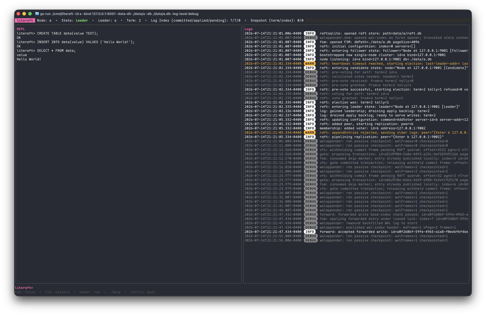

# literaft



literaft is a RAFT-based SQLite driver. It is built on
[`ncruces/go-sqlite3`](https://github.com/ncruces/go-sqlite3) and
[`hashicorp/raft`](https://github.com/hashicorp/raft). It:
* replicates a database across members using the RAFT protocol
* supports follower-computed writes 
* maintains SQLite file compatibility for (readonly) out-of-process connections
* supports fully interactive local transactions
* is entirely Cgo-free
* implements a `database/sql` driver to be a drop-in replacement for other SQLite drivers

Each node embeds the driver and opens the database in-process. The nodes form a
RAFT cluster among themselves; every committed write is replicated so all
replicas hold byte-for-byte identical `.db`/`-wal`/`-shm` files. No external
database or separate server process is required. The intended deployment is a
set of application instances that need shared, strongly-consistent state without
additional infrastructure, for example the pods of a Kubernetes deployment.

## How it works

literaft runs SQLite in WAL mode and intercepts writes at the VFS layer. In WAL
mode a transaction becomes visible when the wal-index header's `mxFrame` is
advanced, not when frames land in the `-wal` file. literaft withholds a
transaction's commit frame from the `-wal` file until its page images reach a
RAFT quorum, then lets SQLite publish the transaction normally. Two consequences:

- Readers (local and external) never observe an un-replicated transaction,
  because visibility is gated on quorum.
- A rejected transaction is not crash-recoverable: its commit frame never
  reaches disk, and WAL recovery replays only up to the last valid commit frame.

RAFT log entries are physical redo: an ordered list of `(pgno, page_image)`
plus the post-commit database size. Followers apply entries in strict total
order into their local `-wal` and wal-index. SQLite is not patched and the
on-disk format is unchanged.

## Properties

- **`database/sql` driver.** Standard driver interface; no custom query API.
- **Strong consistency.** Writes are serialized through the RAFT leader and
  become visible only after quorum. There is no page-level conflict resolution;
  conflicts are prevented by RAFT's total order.
- **Writes on any node.** Writes execute on the leader. Followers reject writes
  by default, or forward them to the leader when the log adapter is wrapped in
  `log.ForwardingLog`.
- **Concurrent connections.** Multiple read-write connections per process, with
  stock SQLite WAL concurrency (single writer, concurrent readers). Reads never
  block on replication; each commit blocks for one RAFT round-trip.
- **External read-only access.** The `.db`, `-wal`, and `-shm` files stay
  byte-for-byte SQLite-compatible, so an unmodified SQLite process (e.g. the
  `sqlite3` CLI) can open the database read-only while a node is running.
- **Pure Go.** No cgo; the SQLite engine runs on wazero.

See [Consistency guarantees](#consistency-guarantees) for the full semantics.

## Status

Experimental (pre-1.0). A multi-node cluster replicates writes, followers serve
reads, nodes can be added and removed while the cluster is live, and a node that
falls too far behind catches up automatically via snapshots. See
[the milestones](https://github.com/fuchstim/literaft/milestones) for status.

## Install

```sh
go get github.com/fuchstim/literaft
```

## Quickstart

The example runs a single-node cluster in one process, a minimal version of
[`cmd/literaft`](cmd/literaft). It wires the components a node needs: a gRPC
server hosting the raft transport and the write-forwarding service, a
[`fsm.FSM`](fsm/fsm.go) (owns the replicated SQLite database), an `*hraft.Raft`
(standard `hashicorp/raft`, here with in-memory stores), a
[`log.ForwardingLog`](log/forward.go) wrapping a
[`log.SingleWriterLog`](log/singlewriter.go) (adapts raft to the gate and
forwards follower writes to the leader), and [`driver.New`](driver/driver.go)
(wires it into a `database/sql` driver).

```go
package main

import (
	"database/sql"
	"errors"
	"fmt"
	"net"
	"time"

	grpctransport "github.com/Jille/raft-grpc-transport"
	"github.com/hashicorp/go-hclog"
	hraft "github.com/hashicorp/raft"
	"google.golang.org/grpc"
	"google.golang.org/grpc/credentials/insecure"

	"github.com/fuchstim/literaft/cmd/literaft/forward"
	"github.com/fuchstim/literaft/driver"
	"github.com/fuchstim/literaft/fsm"
	"github.com/fuchstim/literaft/log"
)

func main() {
	const (
		nodeID   = "node-1"
		bindAddr = "127.0.0.1:9001"
	)

	logger := hclog.New(&hclog.LoggerOptions{Level: hclog.Info})

	// fsm.New enables WAL mode on the database file and takes ownership of its
	// lifecycle (checkpointing, follower-apply, snapshots).
	f, err := fsm.New("node.db", fsm.WithLogger(logger))
	if err != nil {
		panic(err)
	}
	defer f.Close()

	// One gRPC server per node hosts both the raft transport and the
	// write-forwarding service, so bindAddr is the only address a node exposes.
	lis, err := net.Listen("tcp", bindAddr)
	if err != nil {
		panic(err)
	}
	dialOptions := []grpc.DialOption{grpc.WithTransportCredentials(insecure.NewCredentials())}

	tm := grpctransport.New(hraft.ServerAddress(bindAddr), dialOptions)
	grpcServer := grpc.NewServer()
	tm.Register(grpcServer)

	// The forwarding transport shares that same server, so the leader's forward
	// address is just its raft address -- an identity resolver.
	fwd := forward.New(func(a hraft.ServerAddress) string { return string(a) }, dialOptions)
	fwd.Register(grpcServer)

	go func() {
		if err := grpcServer.Serve(lis); err != nil {
			logger.Error("gRPC server stopped", "error", err)
		}
	}()
	defer grpcServer.Stop()

	// In-memory stores keep the example self-contained. Any compatible
	// stores can be used, though some stores may have a bigger performance
	// impact than others (ex. boltdb is rather slow as it fsyncs on every write).
	// cmd/literaft uses this package's raftsqlite which implements a SQLite-backed
	// RAFT log/stable store with WAL mode enabled.
	store := hraft.NewInmemStore()
	snaps := hraft.NewInmemSnapshotStore()

	config := hraft.DefaultConfig()
	config.LocalID = hraft.ServerID(nodeID)
	config.Logger = logger.Named("raft")

	r, err := hraft.NewRaft(config, f, store, store, snaps, tm.Transport())
	if err != nil {
		panic(err)
	}
	defer r.Shutdown()

	// Bootstrap a new single-node cluster. Additional nodes would join through
	// an existing member instead (see "Running a real cluster" below).
	err = r.BootstrapCluster(hraft.Configuration{
		Servers: []hraft.Server{{ID: config.LocalID, Address: hraft.ServerAddress(bindAddr)}},
	}).Error()
	if err != nil && !errors.Is(err, hraft.ErrCantBootstrap) {
		panic(err)
	}

	// log.SingleWriterLog owns leader/ready/drain state; wrapping it in a
	// log.ForwardingLog lets follower connections forward writes to the leader
	// (under a base-index check) rather than rejecting them.
	l := log.NewSingleWriterLog(r, log.WithLogger(logger))
	defer l.Close()
	adapter := log.NewForwardingLog(l, fwd, f, log.WithLogger(logger))

	// driver.New registers a process-unique gated VFS and returns a
	// database/sql-compatible driver. journal_mode=WAL is already set by
	// fsm.New; the driver applies synchronous=NORMAL to every connection.
	d := driver.New(f, adapter, driver.WithLogger(logger))
	defer d.Close()

	sql.Register("literaft", d)
	db, err := sql.Open("literaft", "")
	if err != nil {
		panic(err)
	}
	defer db.Close()

	// A freshly bootstrapped node needs a moment to elect itself leader before
	// it can accept writes.
	for r.State() != hraft.Leader {
		time.Sleep(50 * time.Millisecond)
	}

	// A committed write has been replicated to a RAFT quorum; the commit blocks
	// for exactly that one round-trip. Reads never do.
	if _, err := db.Exec(`CREATE TABLE IF NOT EXISTS kv (k TEXT PRIMARY KEY, v TEXT)`); err != nil {
		panic(err)
	}
	fmt.Println("committed and replicated")
}
```

Every other connection this process opens against the same registered VFS name
(more `*sql.DB` handles, or another goroutine's `db.Conn()`) gets the same
concurrent read-write semantics as stock SQLite in WAL mode.

### Rejecting writes on followers

The example enables write forwarding by wrapping the `log.SingleWriterLog` in a
`log.ForwardingLog`: a write on a follower connection is shipped to the leader
and accepted only if it was computed on the leader's current applied state
(otherwise it is rejected as stale and the client re-runs it against fresher
state). To reject follower writes outright instead (returning a leader hint the
client redirects on), pass the plain `log.SingleWriterLog` to `driver.New` and
drop the forwarding transport. `cmd/literaft` forwards by default and switches
to rejection with `-forward-writes=false`. See
[`docs/FOLLOWER_WRITES.md`](docs/FOLLOWER_WRITES.md).

## Running a real cluster

[`cmd/literaft`](cmd/literaft) is a complete node process built on the same
components as the example, adding an on-disk [`raftsqlite`](raftsqlite)
log/stable store, file-based snapshots, a cluster join/leave control plane, and
an interactive SQL REPL.

```sh
go build -o literaft ./cmd/literaft

# The first node bootstraps a new single-node cluster (no -join).
./literaft -id node1 -bind 127.0.0.1:9001 -data-dir ./data/node1 -db ./data/node1/db.sqlite

# Each additional node joins through any existing member's address. The join
# request is forwarded to the current leader, which adds the node as a voter.
./literaft -id node2 -bind 127.0.0.1:9002 -data-dir ./data/node2 -db ./data/node2/db.sqlite \
  -join 127.0.0.1:9001

# Decommission a node (removes it from the configuration via any member,
# forwarded to the leader). This is separate from stopping a node.
./literaft -leave -id node2 -join 127.0.0.1:9001
```

The raft transport and the membership control plane share one gRPC server per
node, so `-bind` is the only address a node exposes. Membership is durable: an
ordinary shutdown leaves the configuration untouched, so restarting a node (a
new binary, a crash) brings it back automatically as a voter, and the leader
resumes replicating to it. A node that restarts at a different address
re-announces itself on startup (through any reachable member, or the `-join`
hint if given) so the leader learns the new address. Removing a node is
therefore explicit (`-leave`, or `RemoveVoter` over gRPC), not a side effect of
stopping the process. The leader's REPL also has `.addvoter <id> <address>`.

Follower connections accept writes by default, forwarded to the leader under the
base-index check; pass `-forward-writes=false` to reject them with a leader hint.

## Consistency guarantees

literaft replicates physical page images through RAFT, applied in the same total
order on every node, so all replicas converge to byte-for-byte identical
`.db`/`-wal`/`-shm` files.

- **Totally-ordered writes, no merges.** Every committed write is serialized
  through RAFT's single-leader log. There is no page-level conflict resolution;
  conflicts are prevented by that total order.
- **Quorum-gated visibility and durability.** A write becomes visible (to local
  readers and to external SQLite processes) only after it reaches RAFT quorum:
  the commit-frame gate withholds the transaction's commit frame until RAFT
  commits. A rejected write's commit frame never reaches disk, so it is not
  crash-recoverable. Durability comes from the quorum, not from local `fsync`
  (`synchronous=NORMAL` is expected).
- **Read-your-writes on the node that wrote.** Once `COMMIT` returns, every
  subsequent read on that node (including an external, unmodified SQLite process
  reading its files) observes the write.
- **Follower reads can be stale.** A follower serves reads from its own
  most-recently-applied state, which may lag the leader. literaft does not
  provide linearizable cross-node reads: a read on one node is not guaranteed to
  see a write another node's `COMMIT` just returned.
- **Writes are leader-only.** A write attempted on a follower is rejected with a
  leader hint (the client redirects), unless the node is configured with the
  write-forwarding transport (`cmd/literaft` enables it by default). A forwarded
  write is accepted only if its page images were computed on exactly the leader's
  current applied state; otherwise it is rejected as stale and re-run against
  fresher state.

### Stale-read no-op caveat

A read-modify-write issued on a follower (an `UPDATE`/`DELETE` with a `WHERE`
clause, or an `INSERT ... SELECT`) evaluates its condition against the
follower's local, possibly-stale snapshot.

- If the statement changes rows, its page images are validated against the
  leader's current state before being accepted; a stale follower's write is
  rejected and re-run against fresher state, so correctness holds.
- If the stale read makes the statement match nothing, it produces no changes,
  so it never enters the RAFT log, is never validated, and returns success as a
  local no-op. Against up-to-date cluster state the same statement might have
  modified rows.

A read-modify-write that must be evaluated against the latest committed cluster
state should be issued on the leader (or after ensuring the follower has caught
up). See [`docs/FOLLOWER_WRITES.md`](docs/FOLLOWER_WRITES.md).

## Comparison

|                             | **literaft**                      | [Litestream](https://litestream.io) | [dqlite](https://dqlite.io)  | [rqlite](https://rqlite.io)  |
| --------------------------- | --------------------------------- | ------------------------------------ | ---------------------------- | ---------------------------- |
| **What it is**              | Embedded replicated SQLite        | Streaming backup / disaster recovery | Embedded replicated SQL engine | Standalone replicated SQL database |
| **How you use it**          | `database/sql` driver, in-process | Sidecar process beside your DB       | C library (Go via cgo)       | Separate server, HTTP/JSON API |
| **Consensus**               | Raft (synchronous quorum)         | None (async ship to object storage)  | Raft (synchronous quorum)    | Raft (synchronous quorum)    |
| **Replicates**              | Physical page images              | WAL pages → S3/Azure/etc.            | WAL frames                   | SQL statements               |
| **Data storage**            | On disk                           | On disk                              | In memory (Raft log on disk) | On disk                      |
| **Interactive transactions**| Yes                               | Yes (plain SQLite)                   | Yes                          | No (batched statements only) |
| **HA / automatic failover** | Yes (multi-node)                  | No (restore from a backup)           | Yes                          | Yes                          |
| **External SQLite readers** | Yes (files stay stock-compatible) | Yes (it's your normal file)          | No (patched SQLite + custom storage) | Yes ([Reads are supported](https://rqlite.io/docs/guides/direct-access/)) |
| **Runtime**                 | Pure Go, no cgo                   | Go                                   | C                            | Go                           |

- **[Litestream](https://litestream.io)** is asynchronous backup of a single
  SQLite database to object storage for point-in-time recovery. It is not a
  consensus system: no quorum, no live multi-node failover, and writes not yet
  shipped are lost on a crash.
- **[dqlite](https://dqlite.io)** also replicates at the WAL/page level over
  Raft, but is a C library built on a patched SQLite with its own storage format
  and wire protocol, used from Go via cgo. It holds the entire database in
  memory and persists only the Raft log, so the dataset must fit in RAM.
- **[rqlite](https://rqlite.io)** is a standalone server accessed over HTTP/JSON
  that replicates SQL statements over Raft. It has no interactive transactions;
  statements are batched into a single request.

Litestream, dqlite, and rqlite are mature, widely deployed projects; literaft is
pre-1.0.

## Further reading

- [`docs/DESIGN.md`](docs/DESIGN.md): full design (write/read/checkpoint/
  follower-apply paths, external-reader safety, conflict handling).
- [`docs/DECISIONS.md`](docs/DECISIONS.md): ADR log of rejected alternatives.
- [`docs/FOLLOWER_WRITES.md`](docs/FOLLOWER_WRITES.md): the write-forwarding
  protocol (base-index check, skip-marker state machine, failure matrix).
- [`docs/ROADMAP.md`](docs/ROADMAP.md): milestone status, mirrored from GitHub.
- [`docs/WAL_FORMAT.md`](docs/WAL_FORMAT.md): on-disk byte layout reference.
- [`docs/NCRUCES_NOTES.md`](docs/NCRUCES_NOTES.md): notes on building on
  `ncruces/go-sqlite3`.

## Contributing

The engine is pure Go (wazero); a plain checkout builds without extra toolchain
setup:

```sh
go build ./...
```

The test suites are [Ginkgo](https://onsi.github.io/ginkgo/)/Gomega; run them
using:

```sh
make test/unit          # Run unit tests (fast)
make test/correctness   # Run correctness tests (slow)
```

See [`docs/DESIGN.md`](docs/DESIGN.md) for the architecture and
[`docs/DECISIONS.md`](docs/DECISIONS.md) for the reasoning behind it.
